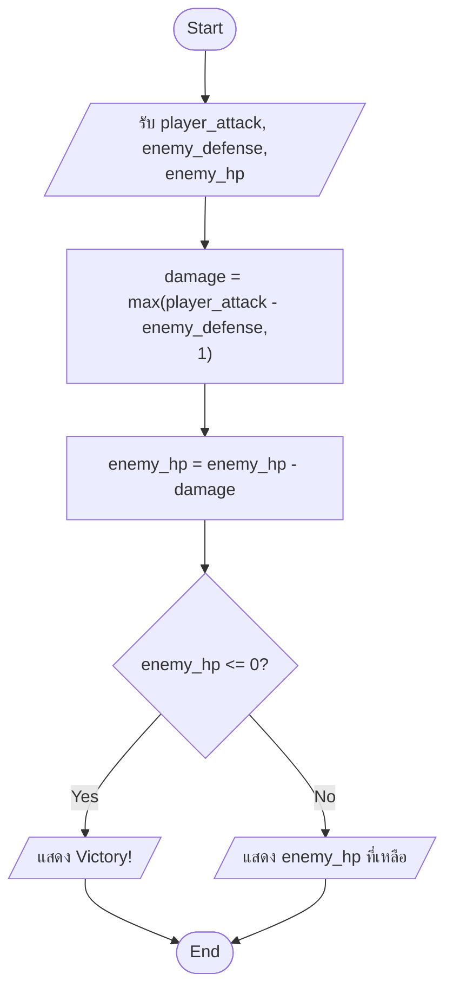
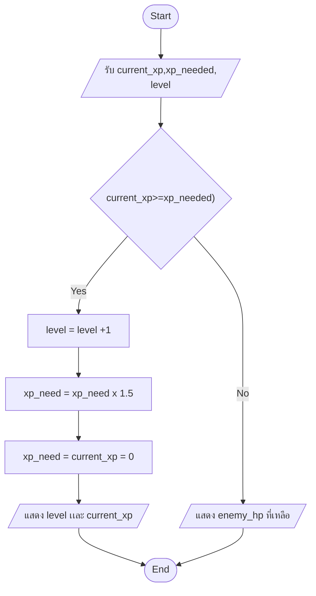
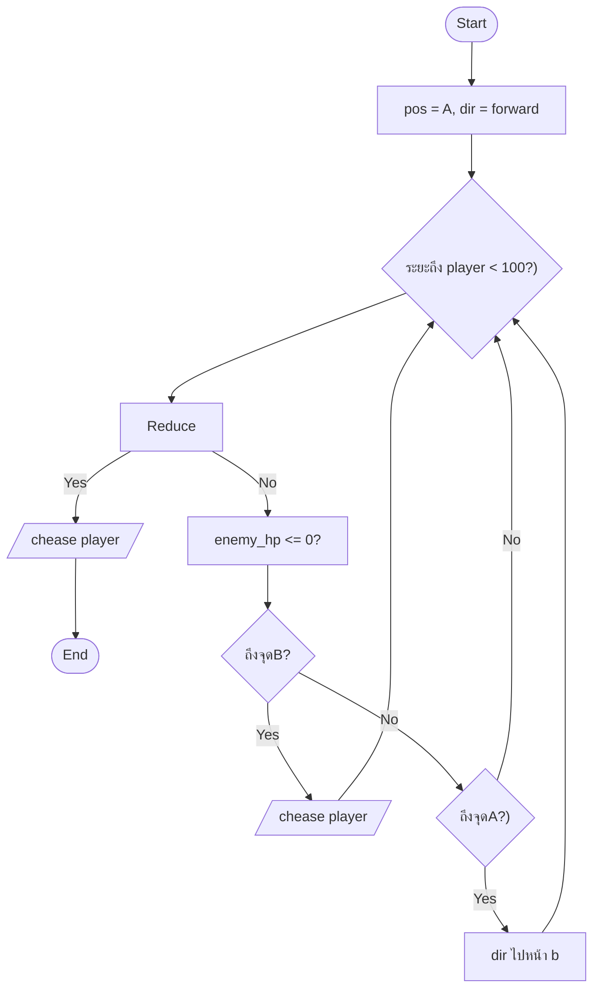

```mermaid
flowchart TD
Start([Start]) --> Input[/รับ player_attack, enemy_defense,
enemy_hp/]
Input --> Calc["damage = max(player_attack - enemy_defense,
1)"]
Calc --> Reduce["enemy_hp = enemy_hp - damage"]
Reduce --> D1{enemy_hp <= 0?}
D1 -->|Yes| Win[/แสดง Victory!/]
D1 -->|No| Show[/แสดง enemy_hp ที่เหลือ/]
Win & Show --> End([End])
```


```mermaid
flowchart TD
Start([Start]) --> Input[/รับ current_xp,xp_needed,
level/]
Input --> Calc{"current_xp>=xp_needed)"}
Calc --> |Yes|Reduce["level = level +1"]

Reduce --> D1[enemy_hp <= 0?]
D1[xp_need = xp_need x 1.5]
-->D2[xp_need = current_xp = 0]
D2 --> Win[/แสดง level เเละ current_xp/]
Calc -->|No| Show[/แสดง enemy_hp ที่เหลือ/]

Win & Show --> End([End])
```


```mermaid

flowchart TD
Start([Start]) --> Input[pos = A, dir = forward]
Input --> Calc{"ระยะถึง player < 100?)"}
-->
Reduce --> |Yes|D1[/chease player/]
--> End([End])
Reduce --> |No|D2[enemy_hp <= 0?]
-->Calc1{"ถึงจุดB?"}
 Calc1--> |Yes|d3[/chease player/]
-->Calc{"ระยะถึง player < 100?)"}
 Calc1-->|No|Calc2{"ถึงจุดA?)"}
Calc2-->|No|Calc{"ระยะถึง player < 100?)"}
Calc2-->|Yes|d4[dir ไปหน้า b]
-->Calc{"ระยะถึง player < 100?)"}


```

```

```
